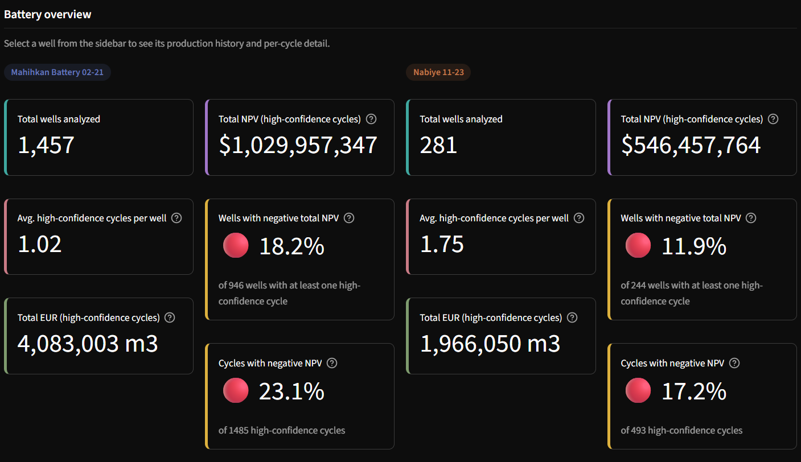
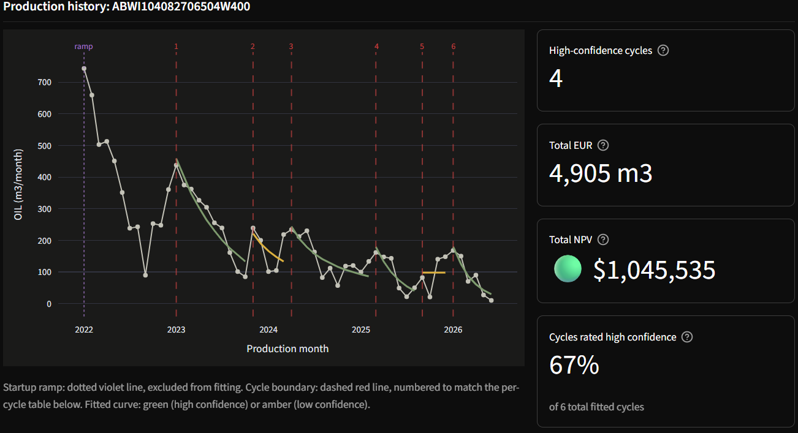
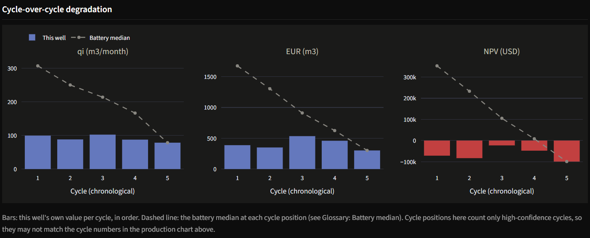
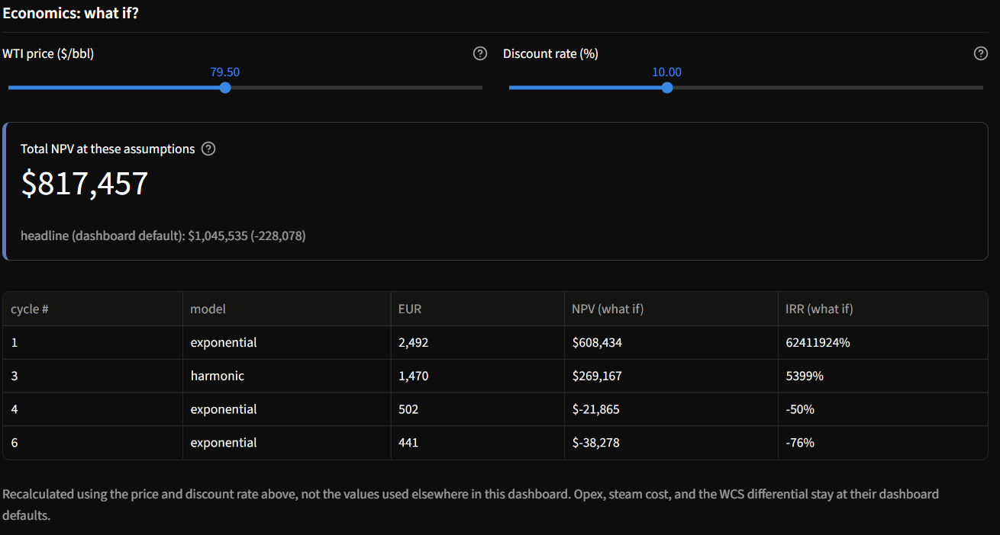

# Cold Lake CSS Decline Dashboard

Per-cycle Arps decline curve analysis and project economics for two Cold Lake CSS batteries, built on real Alberta production data (Petrinex). Live dashboard: [cold-lake-petro-decline.streamlit.app](https://cold-lake-petro-decline.streamlit.app/)

## Preview


*Landing view: per-battery metric cards (wells, avg. cycles, EUR, NPV, negative-NPV rate).*


*Raw monthly oil, cycle boundaries, and fitted Arps curve per cycle (green = high confidence, amber = low).*


*A well's qi/EUR/NPV across its own cycles vs. the battery median at the same cycle position.*


*Price and discount-rate sliders recompute NPV/IRR live for the selected well.*

## Why this isn't a standard decline curve project

Cold Lake bitumen is too thick to flow on its own, so operators use Cyclic Steam Stimulation (CSS): inject steam, soak, produce until the rate falls off, re-steam, repeat. A well can go through this many times over its life, that rules out the usual decline-curve approaches:

1. **Well-level continuous decline** doesn't work: wells cycle in a sawtooth, not a smooth decline.
2. **Pad-level aggregation** doesn't work either. Mahihkan is a flat, managed plateau; Nabiye's apparent rise was new wells coming online, not existing wells improving.
3. **Per-cycle analysis** does: detect each steam-soak-produce cycle per well, fit a decline curve to each cycle on its own.

## Batteries analyzed

| Battery | Operator | Wells | HC cycles | Avg. HC cycles/well | EUR (m3) | NPV | Wells w/ negative NPV | Cycles w/ negative NPV |
|---|---|---|---|---|---|---|---|---|
| Mahihkan Battery 02-21 | Imperial Oil | 1,457 | 1,485 | 1.02 | 4,083,003 | $1,029,957,347 | 18.2% (of 946) | 23.1% |
| Nabiye 11-23 | Imperial Oil | 281 | 493 | 1.75 | 1,966,050 | $546,457,764 | 11.9% (of 244) | 17.2% |

Combined: 69.6% of fitted cycles are low confidence, 21.6% of high-confidence cycles are negative NPV, total modelled NPV $1,576,415,111 (mean $797k, median $315k **per cycle**). **"Modelled NPV" is not an asset valuation**, see Key findings and Limitations for why. EUR is in m3 (Petrinex's unit). "Avg. HC cycles/well" is out of every well, including the ~half with zero or one.

## Theory

**Arps decline**: `q(t) = qi / (1 + b*Di*t)^(1/b)`, fit per cycle in three forms (exponential b=0, harmonic b=1, hyperbolic general form), on producing months only (shut-in gaps excluded). Winner picked **by AICc, not R2**: hyperbolic's extra parameter almost always wins on raw R2 regardless of merit; AICc corrects for that even at small sample sizes. Each form needs at least 2 residual degrees of freedom to be attempted.

**EUR**: `EUR = sum(t=0..T-1) q(t)`, where T is the cycle's observed duration, not an economic limit. Summed on the same monthly grid NPV uses, so the two are always consistent.

**NPV**: `NPV = sum(t) [q_t * (price - opex) / (1+r)^t] - steam_cost`. Price is WCS (WTI minus differential): a single day's live EIA spot quote held flat for the whole projection, not a forward strip, with a `config.yaml` fallback.

## Methodology notes

- **Cycle detection**: peak detection with relative/local prominence (a peak must clear its own preceding trough, not the well's all-time max), 4-month minimum spacing, minimum-volume filter, startup ramp excluded. The 40% prominence threshold was checked, not assumed: 25 rejected near-miss candidates (30-40% band) judged by eye, ~60% were confirmed noise, validating the cutoff.
- **Confidence flagging**: low confidence if the cycle is too short, R2 is poor, a parameter hits its bound, or too few producing months remain. Most of the 69.6% low-confidence rate is real production being non-monotonic while Arps curves are strictly monotonic. Excluded from EUR/NPV totals.
- **Shut-in months are excluded from fitting, not from EUR/NPV.** The curve fits producing months only, but still projects across the cycle's full duration, so a real mid-cycle interruption gets modeled revenue it didn't actually earn. Deliberate choice, not an oversight.

## Key findings

- **The finding this project stands behind: recovery drops cycle-over-cycle.** qi declines in ~70% of wells, per-cycle recovery in ~60%, both within-well and cross-sectionally, across the 609 wells with a genuine 1st->2nd high-confidence transition (433 Mahihkan). Caveat, addressed head-on: since "cycle 1" can itself be inflated by non-cyclic initial production (below), part of this drop is mechanical, not pure reservoir decline. The cross-sectional check, which doesn't depend on any well's "cycle 1" specifically, shows the same direction, which is why the finding holds up rather than being purely a labeling artifact.
- **"Cycle 1" isn't always a real steam cycle.** For a well whose whole history starts at the 2022 data horizon, what's left after the startup ramp still gets labeled "cycle 1", even with no real 2nd steam job. Example: this project's top-NPV well (`ABWI105110806603W400`, $40.2M) came online 2024-05, produced continuously since, no re-steam pattern in the raw data, its "cycle 1" is a peak-detection artifact (41% prominence vs. the 40% cutoff). 581 of 1,190 wells with a usable fit (49%) have exactly one HC cycle, 88% of them Mahihkan (513 of 581), the older battery, not Nabiye.
- **NPV/EUR totals are a scale illustration, not the headline.** Real barrels under illustrative cost assumptions, including "cycle 1"s that aren't real re-stimulations, skewed by the top 10 wells (14.5% of total NPV).
- Negative-NPV share rises with cycle position (17.5% → 25.2%), but this is largely mechanical: steam cost is a flat $200k/cycle, so "negative NPV" is close to "produced under ~3,700 bbl at today's $83.90 WTI", a threshold that drifts with the live price, and later cycles produce less.

## Limitations

- Petrinex's Files API 404s before 2022-01. Older data may exist via other Petrinex/AER channels (their catalogue references data back to 2002), not verified or pursued here. With ~1-1.75 HC cycles/well, most wells show one partial cycle, not a real multi-decade stack.
- Revenue is priced at the WCS blended rate against raw bitumen volume with only a flat differential; a real bitumen netback nets out diluent (condensate, ~25-30% of WCS) separately, so netback here is somewhat optimistic.
- **No Crown royalty or abandonment/reclamation liability.** Alberta oil sands royalty is ~1-9% of gross pre-payout, 25-40% of net post-payout. Not modeled at all, materially overstates every NPV figure.
- All monetary figures are USD (unstated in the dashboard until now). Alberta opex is normally quoted CAD; no conversion applied.
- The R2 >= 0.5 "high confidence" threshold is a starting guess, not validated. Tightening to R2 >= 0.7 keeps 69.6% of cycles but only 67.3% of NPV ($1.06B vs $1.58B), the totals are sensitive to this line.
- The two batteries are a hardcoded constant (`TARGET_BATTERIES` in `data.py`), not a runtime parameter. Built for CSS thermal specifically, wouldn't hold for conventional or SAGD without adaptation.
- IRR can hit meaningless thousands-of-percent values for a tiny/front-loaded cost basis; NPV is the reliable number. IRR is also undefined (not a bug) when a cash flow never goes negative, shown as "n/a (never negative)".
- Production is the instantaneous monthly rate (no mid-month convention). Curve fitting is unweighted, so early high-rate months dominate more than the tail, which is what EUR and late-cycle economics hinge on.
- Two modeling shortcuts both flatter NPV slightly: the 10% discount rate is a nominal convention applied to flat, non-escalating (real) cash flows, which understates true NPV; and steam cost is charged in the same month as peak production (t=0), with no lag for the real steam-soak period beforehand.

## Files

- [`app.py`](app.py): Streamlit dashboard (7 panels, 2 tabs)
- [`src/petro_decline/data.py`](src/petro_decline/data.py): Petrinex pull, filtering, injector ID
- [`src/petro_decline/decline.py`](src/petro_decline/decline.py): Arps fitting, model selection
- [`src/petro_decline/eur.py`](src/petro_decline/eur.py): EUR
- [`src/petro_decline/economics.py`](src/petro_decline/economics.py): NPV, IRR, live WTI
- [`config.yaml`](config.yaml): sourced economic assumptions
- [`tests/`](tests/): unit tests, one file per `src/petro_decline/` module
- [`notebooks/detect_cycles_full.py`](notebooks/detect_cycles_full.py): full-scale cycle detection (feeds `decline.py`)
- `data/processed/`, `notebooks/output/`: pipeline outputs, committed so the dashboard runs without re-pulling data

## How to run

```bash
git clone https://github.com/jasonou216/Petro-decline-curve.git
cd Petro-decline-curve
python -m venv .venv
.venv\Scripts\activate       # Windows
source .venv/bin/activate    # Mac/Linux
pip install -r requirements.txt
# add a .env file with EIA_API_KEY=your-key-here (free at eia.gov/opendata)
# without it, the dashboard falls back to config.yaml's dated price
streamlit run app.py
```

## Tools

Python, pandas, numpy, scipy, Streamlit, Plotly, PyYAML, python-dotenv, Petrinex public API, EIA public API.

## Data license

Petrinex data is Government of Alberta Crown copyright, acknowledged here. Used for non-commercial purposes per [Petrinex's terms of use](https://www.petrinex.ca/terms), which permit that without separate consent.

## Skills demonstrated

Time-series analysis • signal processing (peak detection) • nonlinear curve fitting • statistical model selection (AICc) • financial modeling (NPV, IRR, sensitivity analysis) • API integration • data pipeline design • interactive dashboard development • unit testing • domain-specific problem framing (petroleum engineering)

## How this was built

Claude (Anthropic) was used throughout as a coding assistant, implementation, debugging, and structured code review (see `KNOWN_ISSUES.md`). Every methodology call was mine: per-cycle vs. pad-level fitting, AIC-then-AICc model selection, what EUR/NPV should and shouldn't claim, which cost assumptions to flag as illustrative rather than real. Each was checked against the raw data before I accepted it, not taken on faith.
