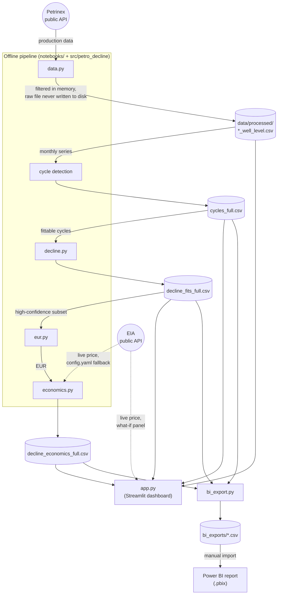

# Architecture

`app.py` reads the committed CSVs for its headline numbers, but also calls `decline.py` and `economics.py` directly at runtime (redrawing fitted curves, live what-if repricing), it isn't purely a static-file reader. `bi_export.py` only ever reads already-computed CSVs, it has no API or pricing dependency of its own.
